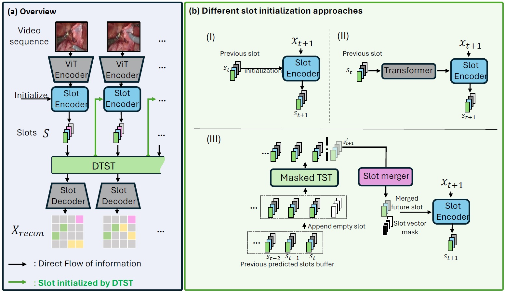

# Future Slot Prediction for Unsupervised Object Discovery in Surgical Video


<p align="center">
  <!-- <video src="asset/Video 1 29 seconds.mp4" width="400" autoplay loop muted playsinline></video> -->
  <video src="asset/Video 2 Multiple FPS.mp4" width="400" autoplay loop muted playsinline></video>
</p>



This repository contains the official implementation for **Future Slot Prediction for Unsupervised Object Discovery in Surgical Video**. The project focuses on unsupervised object-centric learning and future slot prediction in surgical video datasets, leveraging deep learning and temporal feature modeling.

## Features

- **Unsupervised Object Discovery:** Identify and track objects in surgical videos without manual annotations.
- **Slot Attention & Prediction:** Utilizes slot-based neural architectures for object-centric representation and future state prediction.
- **Dataset Handling:** Supports multiple surgical datasets (Cholec, Thoracic, MICCAI, Endovis, etc.) with flexible configuration.
- **Evaluation & Visualization:** Includes tools for evaluation metrics (e.g., Hausdorff, Jaccard) and visualization using Visdom.

## Repository Structure

- `MLP_ds_simmerger_predict.py` — Main script for training and prediction.
- `eval.py`, `eval_box.py`, `eval_slots.py` — Evaluation scripts for different tasks and metrics.
- `display.py`, `visual.py` — Visualization utilities (Visdom integration).
- `model/` — Model architectures, including slot attention and transformer modules.
- `dataset/` — Data loading, preprocessing, and augmentation utilities.
- `data_pre_curation/` — Scripts for preparing and curating datasets.
- `working_para/` — Parameter and configuration files for different experiments and environments.
- `working_dir_root.py` — Central configuration and dynamic import logic.

## Installation

1. **Clone the repository:**
   ```bash
   git clone https://github.com/PCASOlab/Xslot
   cd Xslot
   ```

2. **Install dependencies:**
   - This project uses PyTorch, torchvision, pytorch-lightning, numpy, visdom, and other scientific libraries.
   - You can install dependencies using pip:
     ```bash
     pip install torch torchvision pytorch-lightning numpy visdom pandas scikit-learn opencv-python
     ```
   - For advanced usage, see `video_SA/pyproject.toml` for additional dependencies.

3. **(Optional) Install and run Visdom for visualization:**
   ```bash
   pip install visdom
   python -m visdom.server
   ```

## Usage

- **Training and Evaluation:**  
  Edit `working_dir_root.py` to set the desired mode and dataset. Run the main script:
  ```bash
  python MLP_ds_simmerger_predict.py
  ```
- **Visualization:**  
  Visual outputs are available via Visdom at [http://localhost:8097](http://localhost:8097).

- **Configuration:**  
  Modify files in `working_para/` to set paths, dataset splits, and experiment parameters.

## Datasets

Supported datasets include Cholec80, Thoracic, MICCAI, Endovis, and more. Dataset paths and preprocessing scripts are managed in `working_para/` and `data_pre_curation/`.

## Citation

If you use this codebase, please cite:

```
@inproceedings{liao_future2025,
  title={Future Slot Prediction for Unsupervised Object Discovery in Surgical Video},
  author={Guiqiu Liao, Matjaz Jogan, Marcel Hussing, Edward Zhang, Eric Eaton, Daniel A. Hashimoto},
  booktitle={Medical Image Computing and Computer Assisted Intervention – MICCAI 2025},
  year={2025}
}
```

## License

This project is for academic research purposes only.
